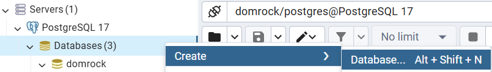
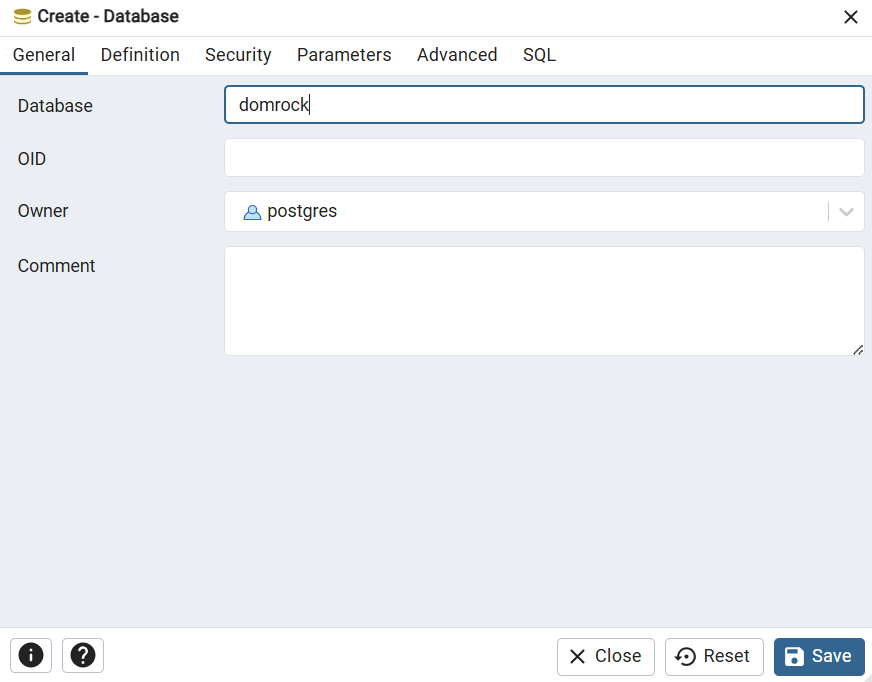
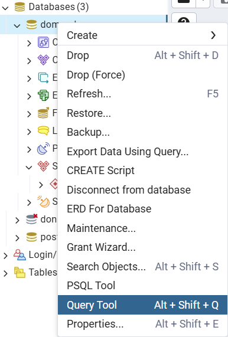
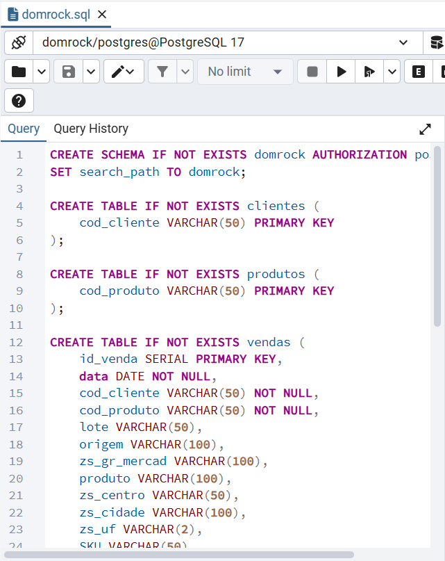
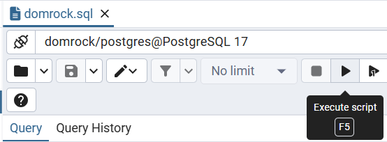

# Como rodar o backend

## Requisitos

- **Python 3.10+**  
- **PostgreSQL** instalado localmente (pode ser o [PostgreSQL oficial](https://www.postgresql.org/download/))
- **pip** (gerenciador de pacotes Python)

## Instalação das dependências

No terminal, na raiz do projeto, execute:

```sh
pip install -r requirements.txt
```

## Configuração do banco de dados local (usando pgAdmin)

1. **Abra o pgAdmin**

2. **Conecte-se ao servidor** usando seu usuário e senha

3. **Crie o banco de dados:**
   - Clique com o botão direito em "Databases" (Bancos de Dados) no painel à esquerda.
   - Selecione "Create" > "Database...".
   - Dê o nome `domrock` e clique em "Save". </br>
   
   

4. **Crie as tabelas e estrutura:**
   - Com o banco `domrock` selecionado, clique em "Query Tool" (Ferramenta de Consulta).
   - Abra o arquivo `sql/domrock.sql` no seu editor de texto, copie todo o conteúdo.
   - Cole o conteúdo no Query Tool do pgAdmin.
   - Clique em "Executar" para rodar o script e criar as tabelas. </br>
   
   
   

> **Obs:**  
> O usuário padrão é `postgres`.  
> Altere seu .env se necessário para combinar com sua configuração local.

## Rodando o backend

1. Entre na pasta `src`:

   ```sh
   cd src
   ```

2. Inicie o servidor FastAPI com Uvicorn:

   ```sh
   uvicorn main:app --reload
   ```

3. Acesse a API em [http://127.0.0.1:8000](http://127.0.0.1:8000))  
   A documentação interativa estará disponível em [http://127.0.0.1:8000/docs](http://127.0.0.1:8000/docs)


